LVM stands for Logical Volume Management, its a concept by which we can extend or reduce storage space to system as space for storage required. In other word, we can say LVM concept provides us a kind of flaxible(Elastic) storage space. 

LVM, or Logical Volume Management, is a storage device management technology that gives users the power to pool and abstract the physical layout of component storage devices for easier and flexible administration.

The main advantages of LVM are increased abstraction, flexibility, and control. Logical volumes can have meaningful names like “databases” or “root-backup”. Volumes can be resized dynamically as space requirements change and migrated between physical devices within the pool on a running system or exported easily. LVM also offers advanced features like snapshotting, striping, and mirroring.

LVM Storage Management Structures
Physical Volume:- Physical volumes are regular storage devices. LVM writes a header to the device to allocate it for management.

Volume Group:- LVM combines physical volumes into storage pools known as volume groups. Volume groups abstract the characteristics of the underlying devices and function as a unified logical device with combined storage capacity of the component physical volumes.

Logical Volume:-A volume group can be sliced up into any number of logical volumes. Logical volumes are functionally equivalent to partitions on a physical disk, but with much more flexibility. Logical volumes are the primary component that users and applications will interact with.

I am gonna integrate LVM concept with hadoop(datanode) to achive elasticity in terms of storage space.  

First of all to Integrate LVM concept with hadoop we need to attach some additional storage units, and need to craete a logical volume space. 

I attach two disk of 6GiB and 8Gib but we can attach more as we need.

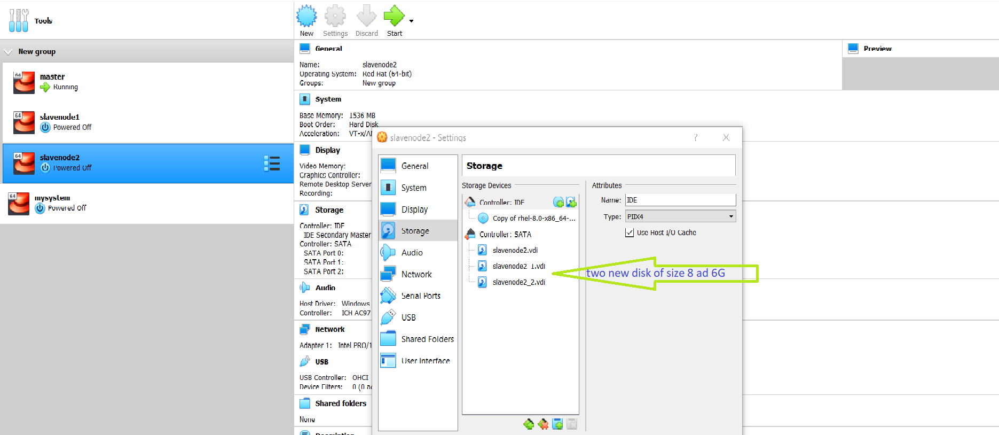

Two hard disk are successfully attached to my system.

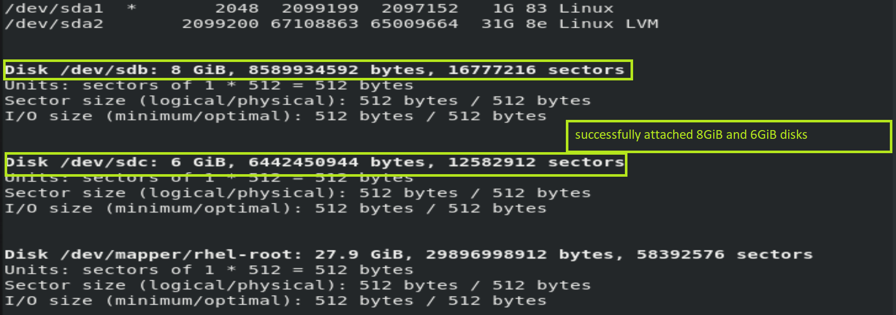

Physical Volume
The first step in creating an LVM volume is to create the physical volume
command:- pvcreate /dev/sdb

physical volume of 8Gib created successfully.

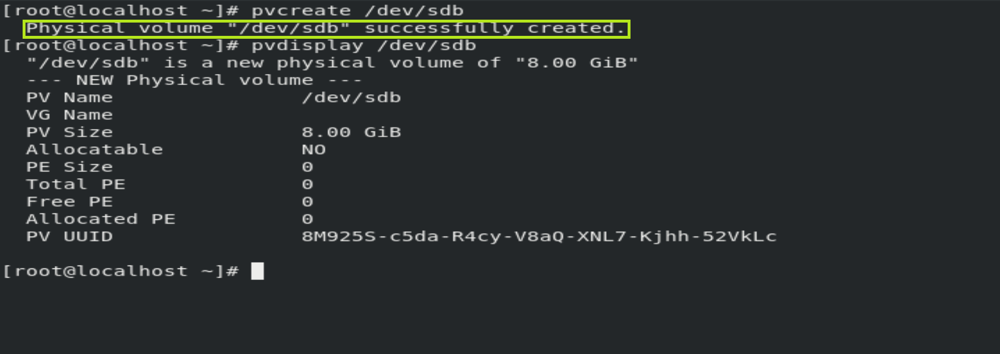

physical volume of 6Gib created successfully.

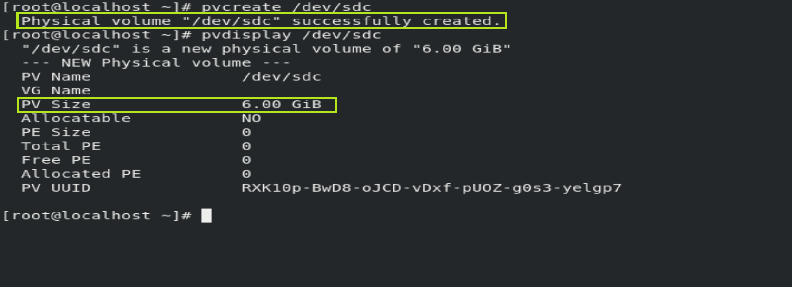

Volume Group
Second we create the volume group
command:-vgcreate myvg /dev/sdb /dev/sdc

A Volume Group with name myvg craeated successfully.

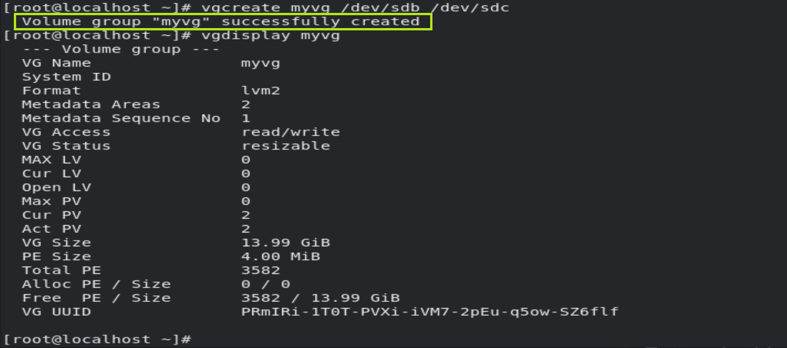

Logical Volume
The final layer in creating a LVM volume on Linux is creating the logical volume.
command:-
A Logical Volume with name mylv and size 9GiB craeated.

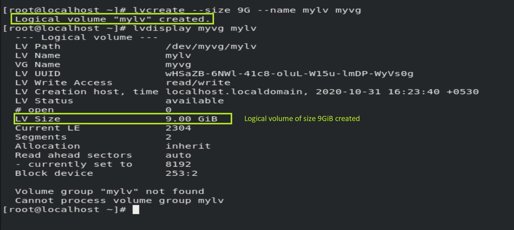

Successfully created, a directory with name lvolume to mount logical volume mylv.

Format process of mylv done successfully.

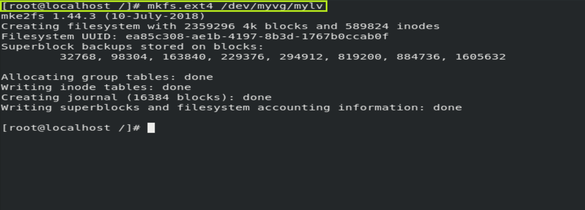

Successfully mylv is mounted on lvolume.

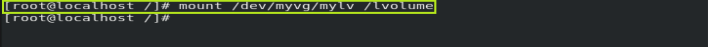

Attachment of lvolume drive(dir) in datanode configuration file.

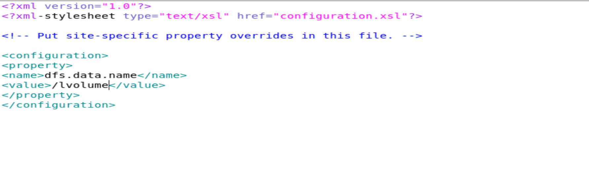

Configured capacity of datanode with around 9GiB storage space.

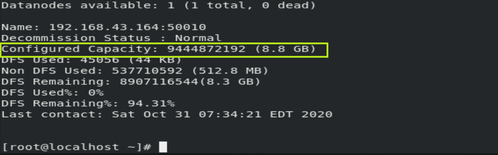

Command to extend the capacity of datanode with size 3GiB
lvextend --size +3G /dev/myvg/mylv

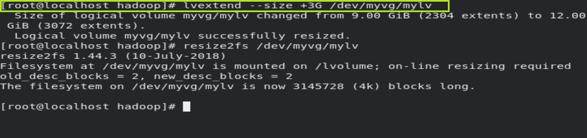

Finally, i have extended datanode storage space capacity with 3GiB.

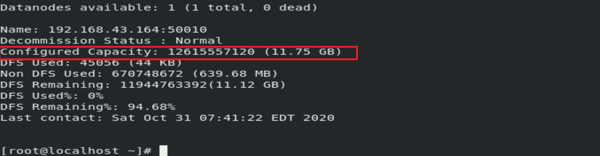

Thank You !

